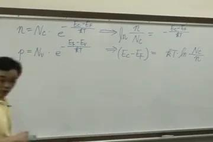

# 11 半导体能带概念与载流子浓度（三）-半导体元件物理的基础（二）

## 视频来源

https://www.bilibili.com/video/BV1WpS4Y2E8E?p=11

## 大纲

- 外质半导体的掺杂问题
  - N型和P型杂质
    - 电子和空穴浓度的计算公式
      - 公式推导过程
        - 方程两边除以$N_c$并取自然对数
        - $E_C - E_F$的表达式推导
      - 掺杂浓度对能级的影响
        - N型掺杂：$N_D$远大于$N_i$时$N \approx N_D$
        - 掺杂浓度增加导致$E_C - E_F$减小
  - 费米能级的变化
    - 本征半导体
      - 费米能级$E_F$与本征费米能级$E_i$重合
      - 位于导带$E_C$和价带$E_V$中间
    - N型掺杂
      - 费米能级$E_F$上移接近导带底$E_C$
      - 高掺杂浓度（N+）时$E_F$与$E_C$重合
    - P型掺杂
      - 费米能级$E_F$下移接近价带顶$E_V$
      - 高掺杂浓度（P+）时$E_F$与$E_V$重合
- 半导体物理中的重要概念
  - 数学公式与物理直观
    - 强调概念理解而非繁琐数学
    - 将数学表达式转化为物理直观
  - 载流子浓度关系
    - 本征半导体与外质半导体的区别
    - 电子浓度与空穴浓度的乘积关系
      - $n \times p = n_i^2$（质量作用定律）
  - 实际应用中的简化
    - 高掺杂浓度时的近似处理
      - N+时$E_F \approx E_C$
      - P+时$E_F \approx E_V$
- 课程重点总结
  - 掺杂对费米能级的影响
    - 五价元素掺杂使$E_F$上移
    - 三价元素掺杂使$E_F$下移
  - 外质半导体的载流子浓度表示
    - 使用本征费米能级$E_i$的表达
    - 重要公式1.17和1.18
  - 半导体物理的核心概念
    - 能带结构与载流子行为
    - 掺杂效应的物理机制

## 总结

### 一句话总结
- 本文详细讲解了外质半导体的掺杂原理，包括N型和P型掺杂对费米能级位置的影响，以及电子和空穴浓度的计算公式及其物理意义。

### 要点
- 掺杂五价元素（N型）会使费米能级$E_F$上移，接近导带底$E_C$；掺杂三价元素（P型）会使$E_F$下移，接近价带顶$E_V$。
- 当掺杂浓度$N_D$或$N_A$远大于本征载流子浓度$n_i$时，载流子浓度近似等于掺杂浓度（$n \approx N_D$或$p \approx N_A$）。
- 高掺杂浓度（N+或P+）时，费米能级$E_F$可视为与导带底$E_C$或价带顶$E_V$重合。
- 外质半导体的电子浓度$n$和空穴浓度$p$的乘积等于本征载流子浓度$n_i$的平方（$n \times p = n_i^2$），即质量作用定律。
- 数学公式的物理意义比具体形式更重要，需将数学表达式转化为直观的物理概念。

### 深度问答
- N型掺杂如何影响费米能级$E_F$的位置？
    - N型掺杂（五价元素）会增加电子浓度，使$E_F$上移，接近导带底$E_C$；高掺杂时$E_F$与$E_C$重合。

- P型掺杂时费米能级$E_F$如何变化？
    - P型掺杂（三价元素）会增加空穴浓度，使$E_F$下移，接近价带顶$E_V$；高掺杂时$E_F$与$E_V$重合。

- 什么是质量作用定律？
    - 外质半导体中电子浓度$n$和空穴浓度$p$的乘积恒等于本征载流子浓度$n_i$的平方（$n \times p = n_i^2$）。

- 为什么高掺杂时$E_F$会与$E_C$或$E_V$重合？
    - 因为高掺杂浓度（N+或P+）使$E_F$移动达到极限位置，分别与导带底或价带顶重合。

- 本征半导体与外质半导体的费米能级有何区别？
    - 本征半导体中$E_F$与本征费米能级$E_i$重合；外质半导体中$E_F$会因掺杂偏离$E_i$，N型上移，P型下移。

### 关键词标签
- 外质半导体
- 掺杂
- 费米能级
- 载流子浓度
- 质量作用定律

### 目标受众
- 半导体物理学生
- 电子工程专业学生
- 半导体器件研究人员
- 微电子技术工程师
- 材料科学研究者

### 术语解释
- 费米能级 ($E_F$): 电子占据概率为50%的能量水平，决定半导体中载流子的分布。
- 本征费米能级 ($E_i$): 本征半导体中费米能级的位置，位于禁带中央。
- 施主掺杂 ($N_D$): 向半导体中掺入五价元素，提供自由电子，形成N型半导体。
- 受主掺杂 ($N_A$): 向半导体中掺入三价元素，提供空穴，形成P型半导体。
- 质量作用定律: 半导体中电子浓度$n$和空穴浓度$p$的乘积恒等于本征载流子浓度$n_i$的平方。

说话人0: *00:00:03 - 00:00:32*

在第一堂课中，我们讨论了外质半导体的掺杂问题，无论是N型还是P型杂质。由此形成的电子和空穴浓度可以用以下公式表示。第一个式子可以改写为课本中的标准公式。

说话人0: *00:00:33 - 00:01:09*

1.15，我们将方程两边同时除以$N_c$，于是左边变为$\frac{N}{N_c}$，右边剩余部分保持不变。接着，对等式两边取自然对数。

说话人0: *00:01:09 - 00:01:32*

对等式两边取自然对数后，该项可消去。接着，将$kT$移至等式右侧，同时调整负号位置，即可得到$E_C$与$E_F$的关系式。

说话人0: *00:01:32 - 00:02:00*

因此，$E_C - E_F$ 可表示为 $-kT \ln \left( \frac{n}{N_c} \right)$。由于存在**负号**，将 $\ln$ 前的负号移入表达式内，即可使分式上下颠倒。

说话人0: *00:02:00 - 00:02:25*

好，这是$N_c$除以$N$，可以吗？好的。我们上一节课最后提到，在第十二页这里，对于N型掺杂，如果掺杂施主的浓度$N_D$远大于$N_i$的话。

说话人0: *00:02:26 - 00:02:49*

电子的浓度$N$，几乎可以用$N_D$来表示。对于N型半导体而言，若$N_D$远大于$N_I$，则$N$近似等于$N_D$。

说话人0: *00:02:50 - 00:03:22*

将其代入该式中，我们得到 $E_C - E_F$ 等于...这个式子并不重要，关键在于课本第12页倒数第四行的内容，请用红笔标注此处。

说话人0: *00:03:24 - 00:03:50*

从该公式可以得出，当施主浓度$N_D$增大时，能量差会减小。请注意$N_D$在此处的变化：掺杂浓度越高，这一项的值越小，因此自然对数项也会相应减小。

说话人0: *00:03:50 - 00:04:04*

因此，当它越小时，能量差也会随之减小。能量差变小意味着什么呢？让我们通过图示来说明。

说话人0: *00:04:04 - 00:04:23*

费米能级$E_F$会逐渐接近导带底$E_C$，如图1.6所示。我们通过数学方法阐述了这一重要概念。

说话人0: *00:04:25 - 00:04:42*

试卷应按照此方式设计。对于不擅长数学的学生，我们需要寻找方法提升他们的数学能力。请注意教材封面，尤其是新版教材，其特色部分第三条明确指出了重点内容。

说话人0: *00:04:43 - 00:04:55*

我们将以最直观的物理现象和电机概念，清晰地描述深奥的半导体元件物理原理，避免繁琐的数学公式。

说话人0: *00:04:56 - 00:06:05*

数学公式并不重要，关键在于**概念**。我们需要将数学表达式转化为物理直观，特别是电机工程中的直观概念。  

对于本征半导体而言，其**费米能级**与本征费米能级是重合的。具体而言，这两个能级重合在导带EC和价带EV的中间位置。  

需要强调的是，对于本征半导体，EI和EF不仅重合，而且位于EC和EV的中央位置。

说话人0: *00:06:06 - 00:06:22*

这是本征半导体。然而，若掺杂五价元素，将使导带底EC与费米能级EF之间的能量差减小。

说话人0: *00:06:22 - 00:06:48*

变小的含义是指费米能级EF向上移动。在本征状态下，本征费米能级EI与EF重合于中间位置。当掺入五价施主杂质后，EF不再与EI重合，而是向上移动。

说话人0: *00:06:50 - 00:07:24*

图1.6A所示的公式表明，随着掺杂浓度ND的增加，费米能级EF会持续上移。当掺杂浓度进一步提高时，EF的位置将相应地继续向上移动。

说话人0: *00:07:24 - 00:07:51*

请注意，教材中有一处未明确说明的内容需要补充。在实际应用中，当掺杂浓度ND非常高时，我们该如何表示这种情况？

说话人0: *00:08:31 - 00:08:51*

通常我们使用NPLUS来表示。对于初学者而言，很多人容易将NPLUS误解为带正电的电子，这是错误的。

说话人0: *00:08:53 - 00:09:07*

我们之前提到，N代表导带中的电子浓度。NPLUS中的正号并非表示带正电的电子，这种概念并不存在。若为带正电的载流子，则应称为空穴。

说话人0: *00:09:07 - 00:09:44*

在NPLUS中，**N代表电子浓度**，PLUS表示浓度很高，即掺杂浓度很大（ND很大）。因此，NPLUS可用于表示高掺杂浓度，也有人用大N或大NPLUS来表示。  

在高掺杂浓度的情况下，实际应用中可将**费米能级（EF）**视为与**导带底（EC）**重合。也就是说，当掺杂浓度很高（NPLUS）时，可以认为EF与EC重合，即EF位于此处。

说话人0: *00:11:02 - 00:11:23*

在部分理论书籍中，会提到超过EF值等概念，但这些在实际应用中几乎不会涉及。就像设计房间时，我们不需要过度考虑门的精确高度。

说话人0: *00:11:24 - 00:11:46*

无需考虑身高200公分的人员进出问题，因此门的高度设计为190公分即可。

说话人0: *00:11:46 - 00:11:59*

在实际应用中，此类情形较为罕见，因此我们只需关注具有重要实际应用价值的场景即可。具体而言，当观察到NPLUS时便足够。

说话人0: *00:12:01 - 00:12:06*

将EF视为与EC重合。

说话人0: *00:12:07 - 00:12:30*

我们将上一堂课中的电动式稍作改写，原本是$P/(NV)$，但由于前面有负号，将其移项后变为$NV/P$。因此，该式可改写为与课本公式1.16类似的表达式。不过，公式的具体形式并不重要，**关键在于其物理意义**。

说话人0: *00:12:36 - 00:12:48*

我们看，相同的

说话人0: *00:12:48 - 00:13:04*

在P型半导体中，若掺杂的受体浓度$N_A$远大于本征载流子浓度$N_i$，对于P型硅而言亦是如此。

说话人0: *00:13:04 - 00:13:26*

对于**P型半导体硅**，掺杂的是**受主杂质**。当受主浓度远大于本征载流子浓度$n_i$时，载流子浓度可以用受主浓度$N_A$表示。将其代入公式后，所得关系式与之前类似。  

那么，对于P型硅而言，当受主掺杂浓度越高时，会产生什么影响呢？

说话人0: *00:13:27 - 00:14:07*

我们再次绘制类似的示意图。在未掺杂时，**本征费米能级**与费米能级在中间位置重合。当掺杂浓度$N_A$较高时，分母增大，导致这一项变小，进而使整体值减小。这意味着$E_F-E_V$的能量差将减小。

说话人0: *00:14:08 - 00:16:05*

这表示费米能级$E_F$需要向下移动，以减小能量差。因此，**$E_F$会向下靠近价带**。不仅如此，随着NA掺杂浓度的增加，$E_F$会进一步下移。

在实际应用中，当NA掺杂浓度很高时，我们使用P+来表示高浓度的受主掺杂，或用大写字母表示。此时，$E_F$可视为与价带顶$E_V$重合。因此，在高浓度掺杂情况下，$E_F$会显著下移。

说话人0: *00:16:05 - 00:16:16*

它与EV重叠。

说话人0: *00:16:16 - 00:16:26*

EI仍位于EC和EV之间。接下来，我们继续讲解第12页的内容。

说话人0: *00:16:26 - 00:16:57*

课本第12页关于**P型半导体**的内容如下：倒数第三行指出，对于P型半导体而言，当受主浓度$N_A$增大时，费米能级$E_F$与价带顶$E_V$之间的能量差会减小。  

**能量差减小意味着什么？**请用红线标注。

说话人0: *00:16:58 - 00:17:33*

这表明费米能级$E_F$会逐渐远离本征费米能级$E_i$，并向价带顶$E_V$靠近，这与第13页图1-6(b)所示情况一致。这一点非常重要。

说话人0: *00:17:33 - 00:17:39*

好，这部分内容没有问题。

说话人0: *00:17:39 - 00:17:59*

掺杂五价元素会使费米能级$E_F$上移，而掺杂三价的硼元素则会使$E_F$下移。虽然原理简单，但这是半导体物理中非常重要的概念。接下来要讨论的也是一个关键点。

说话人0: *00:18:00 - 00:18:43*

第13页第一行开始，我们讨论了**本质半导体**与**外质半导体**。外质半导体的载子浓度$N$或$P$通常需要用本质半导体浓度$N_i$以及本质费米能阶$E_i$来表示。具体表示方法可参考投影片第8页的第一个问题，该问题此前已作说明。

说话人0: *00:18:43 - 00:20:01*

费米能级$E_F$与本征费米能级$E_i$的区别在于：在本征状态下两者相同；掺杂时，$E_F$会偏离$E_i$。对于**N型掺杂**，$E_F$上移（如图A所示）。当掺杂浓度很高时（记为N+），可认为$E_F$与导带底$E_C$重合。对于**P型掺杂**，$E_F$下移，且掺杂浓度越高，$E_F$下移幅度越大。当掺杂浓度极高时（记为P+），可认为$E_F$与价带顶$E_V$重合。

接下来讨论第二个问题：如何最优地表示非本征半导体中电子和空穴的浓度。**这是我们将要重点阐述的内容。**

说话人0: *00:20:01 - 00:20:41*

这一部分内容**非常重要**，应予以重点标记。**掺杂**（Doping）可以使材料转变为外质半导体。  

首先，我们从电子浓度的角度进行分析。关于电子浓度，之前已经讨论过，并在本次课程中进行了修正和补充。

说话人0: *00:20:41 - 00:21:05*

**导带电子浓度**是否等于导带中所有可填充电子的**态密度有效值**？假设存在一定数量的态密度，那么根据课程开始时永祥所讲的内容，还需要乘以一个**概率因子**。从本质上说，这个概率因子至关重要。

说话人0: *00:21:06 - 00:21:22*

当讨论本征半导体时，我们使用公式 $E_C - E_i$ 除以 $kT$。然而，对于非本征半导体，情况则有所不同。

说话人0: *00:21:22 - 00:21:33*

为了区分，我们在此使用EF而非EI，这适用于外质半导体。

说话人0: *00:21:33 - 00:21:37*

其电子浓度需用此式表示。

说话人0: *00:21:38 - 00:22:16*

接下来，我们进行数学变换。**题目要求使用本征费米能级$E_i$来表示**，因此我们需要将其拆解为与$E_i$相关的表达式。为此，我将$E_F$转换为$E_i$，但这一转换需要合理的依据。

说话人0: *00:22:17 - 00:22:24*

少了一个EF，因此需要将EF补充进去。

说话人0: *00:22:24 - 00:22:34*

此外，这里多了一个EI，因此需要将其扣除。

说话人0: *00:22:36 - 00:22:54*

接下来，我们讨论KT的数学表达。当底数均为指数函数时，指数可以相加。因此，请尝试将这两个指数相加。

说话人0: *00:22:54 - 00:23:41*

此处添加一个$E_i$，又减去一个$E_i$，两者相互抵消后，结果与上方表达式相同。这意味着可以将上方项拆分为下方两项。**拆分的目的在于**，前一项正是我们上节课讨论的**本征半导体电子浓度**$n_i$。请参考课本中的相关公式进行验证。

说话人0: *00:23:41 - 00:24:47*

1.13 我们上次讲到，对于**本征半导体**而言，$N$是否等于$n_i$可以表示为导带中所有有效电子态密度$N_c$乘以一个概率。  

1.14 对于本征半导体，价带中电子浓度是否也等于$n_i$？这可以表示为价带中所有可填充电子的有效态密度$N_v$乘以一个概率。因此，$n_i$就等于$N_c$乘以$N_v$再开平方，从而得到课本中的重要公式1.17。

说话人0: *00:24:47 - 00:24:58*

今天我们将讨论掺杂后的外质半导体。

说话人0: *00:24:58 - 00:25:23*

在导电带中，电子浓度$N$可表示为本征半导体载流子浓度$N_i$乘以指数函数$\exp\left(\frac{E_F - E}{kT}\right)$。

说话人0: *00:25:23 - 00:25:57*

$E_i$除以$kT$这个公式必须牢记。这是本征半导体与外质半导体的电子浓度关系。

说话人0: *00:25:57 - 00:26:01*

电子浓度遵循相似的原理。

说话人0: *00:26:03 - 00:26:34*

在讨论**载流子浓度**时，我们统一使用符号$P$表示。无论是上次课程还是本次内容，我们都采用先假设能带结构的方法。所有可能的有效态密度乘以相应的占据概率，该概率用指数函数表示，其值域严格限定在0到1之间。

说话人0: *00:26:36 - 00:27:06*

介于0和1之间，因此这里有一个负号，表示能量需要**大值减去小值**。我们上次提到$E_F$位于$E_V$之上，因此采用$\frac{E_F - E_V}{KT}$进行计算，这不会引起混淆。  

接下来，我需要将其拆分为两项，并且希望这两项与$E_I$相关联。

说话人0: *00:27:06 - 00:27:31*

因此，我将其拆分为$\frac{E_i - E_v}{kT}$一项。此外，由于此处多减去了$E_i$，需要将其加回。

说话人0: *00:27:31 - 00:28:11*

还缺少一个$E_F$，因此需要再推导出$\frac{E_F}{kT}$。我们回顾一下，这两个指数函数相乘时，底数相同则指数相加。$E_i$与$E_i$相消后得到$E_v - E_F$。由于存在负号，可以表示为$E_v - E_F$。**将指数函数拆分为这两项的原因与之前相同**，基于我们之前所见的推导过程。

说话人0: *00:28:13 - 00:28:18*

课本中的公式为1.13。

说话人0: *00:28:18 - 00:28:25*

此处为1.14，我将进行记录。该内容源自1.13。

说话人0: *00:28:25 - 00:28:42*

根据式1.14可知，这两项的乘积等于$N_i$。这一推导过程并非重点。

说话人0: *00:28:42 - 00:28:47*

重要的是结论。

说话人0: *00:28:48 - 00:29:05*

这一结论表明，当外延半导体经过掺杂（doping）处理后，其形成的半导体中空穴浓度$p$可以表示为。

说话人0: *00:29:05 - 00:29:14*

本征半导体的电子浓度$n_i$乘以。

说话人0: *00:29:16 - 00:29:19*

这一项乘以指数函数。

说话人0: *00:29:21 - 00:29:42*

$E_i - E_f$ 除以 $kT$，这样可以吗？这是课本中重要的两个公式1.17。

说话人0: *00:29:44 - 00:29:55*

1.18 是否又可得出？因此，1.17。

说话人0: *00:29:55 - 00:30:15*

是外置半导体的电子浓度。1.18是外置半导体的空穴浓度。因此，外置半导体的电子浓度乘以空穴浓度等于$n_i^2$。

说话人0: *00:30:15 - 00:30:49*

乘以$N_i$的平方，当指数函数相乘时，指数相加恰好抵消，因此$e^0$等于1。于是$N \times p = N_i^2$，即**公式1.19**，这是三个非常重要的表达式。

说话人0: *00:30:49 - 00:30:59*

今天要讲两个最重要的概念。第一个概念是刚才问中翰的问题。

说话人0: *00:30:59 - 00:31:19*

掺杂五价的**EF会向上移动**，在实际情况中，EF最多移动到与EC相同的高度。如果是掺杂三价的物质，EF则会远离EIA向下移动。**掺杂浓度越高**，移动幅度越大，最多可移动到与EV相同的位置。

说话人0: *00:31:20 - 00:31:29*

首先，两者具有相似之处。其次，掺杂后的外延半导体是另一个共同点。

说话人0: *00:31:29 - 00:31:46*

其中电子浓度与空穴浓度可分别用$n_i$表示，且两者的乘积符合前述的质量作用定律。

